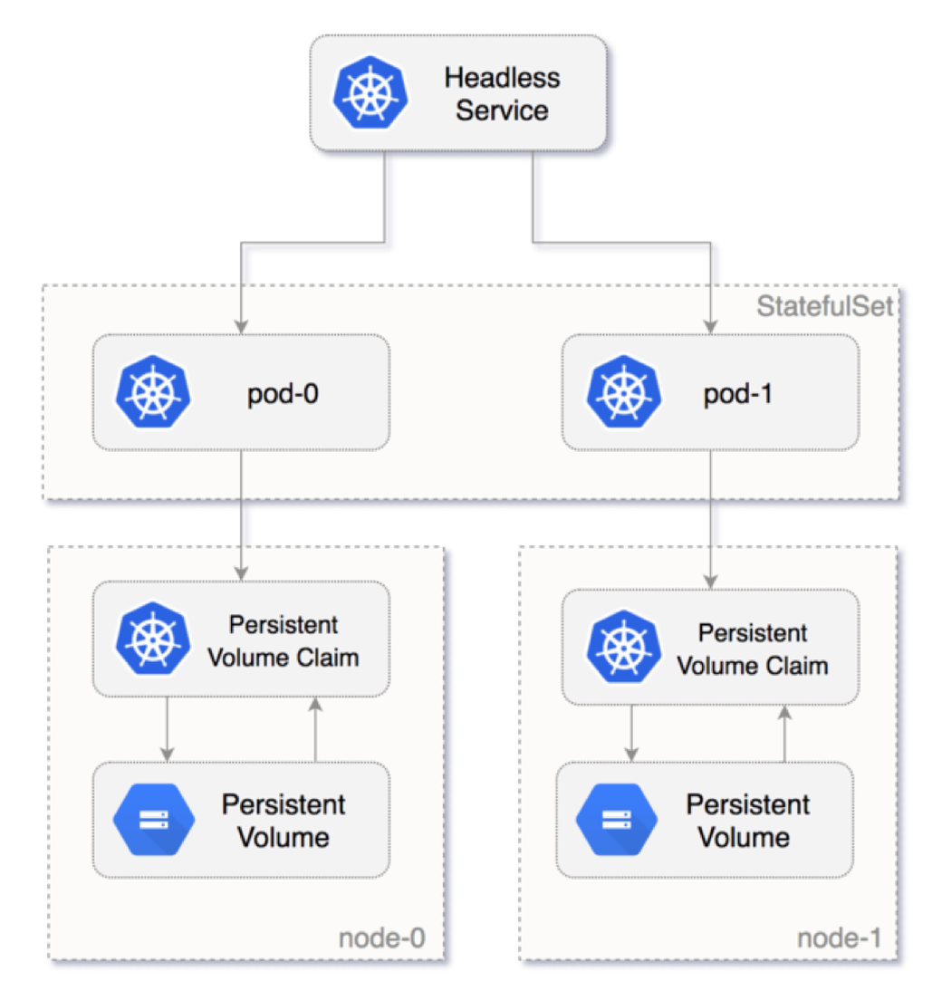
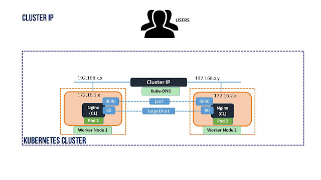
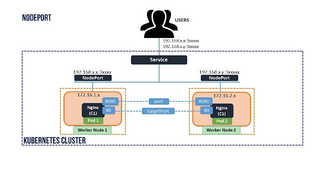
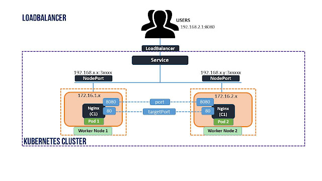

## Kubernetes

Kubernetes is an open-source container orchestration system for automating the deployment, scaling, and management of containerized applications. It was originally developed by Google and is now maintained by the Cloud Native Computing Foundation (CNCF).

Kubernetes uses a declarative approach to manage the desired state of an application. This means that you define what you want your application to look like, and Kubernetes makes sure that the actual state of the application matches your desired state.

One of the key features of Kubernetes is its ability to automatically scale and manage the number of replicas of an application. This allows for horizontal scaling, which means that the application can automatically scale to handle more traffic by adding more replicas of the application.

Kubernetes also provides self-healing capabilities. If a container or a node fails, Kubernetes automatically replaces it with a new one. This helps to ensure that the application is always available and running.

Kubernetes provides service discovery and load balancing. A Kubernetes service is a logical abstraction over a set of pods, providing a stable endpoint for external clients to access the application. Kubernetes automatically load balances traffic across the available replicas of an application.

Kubernetes runs on a cluster of machines and is made up of several components including the Kubernetes Master, which is responsible for the overall management of the cluster, and the Kubernetes Nodes, which are the worker machines that run the containerized applications. Kubernetes also provides a command-line interface (CLI) and an API for interacting with the cluster.

Kubernetes is often used in conjunction with container orchestration systems such as Docker, as well as other technologies such as Prometheus for monitoring and Grafana for visualization. Kubernetes can also be used with various cloud providers such as AWS, Azure and GCP.

---

### Architecture

The Kubernetes architecture is composed of several main components:


#### API serve

This is the core component that exposes the Kubernetes API and handles all API requests. It is responsible for maintaining the desired state of the cluster, such as creating, updating, and deleting resources.

#### Controller manage

This is a daemon that runs on the master node and manages the state of the cluster. It runs various controllers, such as the replication controller, which ensures that the desired number of replicas of a pod are running.

#### etcd

This is a distributed key-value store that is used to store the configuration data of the Kubernetes cluster, such as the desired state of the resources. It is a critical component of the control plane and is used by the API server to store and retrieve data.

#### Kubelet

This is a daemon that runs on each worker node and is responsible for maintaining the state of the pods on that node. It communicates with the API server to ensure that the desired number of replicas of a pod are running and that the containers within the pods are healthy.

#### kube-prox

This is a daemon that runs on each worker node and is responsible for networking and service discovery within the cluster. It forwards traffic to the correct pods based on the service definition and also load balances the traffic between the pods.

#### Scheduler

This is a component that runs on the master node and is responsible for scheduling pods to run on worker nodes. It takes into account factors such as available resources, network topology, and constraints defined by the user.

#### Control plan

This is the set of components that run on the master node and are responsible for maintaining the desired state of the cluster. This includes the API server, controller manager, and etcd.

#### Node

This is a worker machine in a Kubernetes cluster. It can be a physical or virtual machine that runs pods and is managed by the control plane. Each node runs the kubelet and kube-proxy daemons.

---

### Workloads

#### Pod

Pods are the smallest deployable units of computing that you can create and manage in Kubernetes.

A Pod (as in a pod of whales or pea pod) is a group of one or more containers, with shared storage and network resources, and a specification for how to run the containers. A Pod's contents are always co-located and co-scheduled, and run in a shared context. A Pod models an application-specific "logical host": it contains one or more application containers which are relatively tightly coupled. In non-cloud contexts, applications executed on the same physical or virtual machine are analogous to cloud applications executed on the same logical host.

Example:

```bash
apiVersion: v1
kind: Pod
metadata:
  name: nginx
spec:
  containers:
  - name: nginx
    image: nginx:1.14.2
    ports:
    - containerPort: 80
```

---

#### ReplicaSet

A ReplicaSet in Kubernetes is an object that ensures a specified number of replicas of a pod are running and available at all times. It is responsible for creating and managing the pods, and it automatically replaces any pods that fail or are terminated.

A ReplicaSet is defined by a pod template, which specifies the configuration for the pods it creates, including the container image, resource requirements, and environment variables. It also has a selector, which is used to determine which pods it should manage.

When a ReplicaSet is created, it creates the desired number of replicas of the pods according to the pod template. It also continuously monitors the pods and ensures that the desired number of replicas are running. If a pod fails or is terminated, the ReplicaSet replaces it with a new one.

A ReplicaSet also allows for scaling the number of replicas up or down as needed. This can be done manually by updating the replica count in the ReplicaSet or automatically by using a Horizontal Pod Autoscaler.

ReplicaSets are often used in conjunction with Deployments, which are higher-level objects that provide a way to declaratively update and roll back changes to the pods. Deployments create and manage Replica Sets and use them to ensure that the desired number of replicas are running and available at all times.

Example:

```bash
apiVersion: apps/v1
kind: ReplicaSet
metadata:
  name: frontend
  labels:
    app: guestbook
    tier: frontend
spec:
  # modify replicas according to your case
  replicas: 3
  selector:
    matchLabels:
      tier: frontend
  template:
    metadata:
      labels:
        tier: frontend
    spec:
      containers:
      - name: php-redis
        image: gcr.io/google_samples/gb-frontend:v3
```

---

#### Deployment

In Kubernetes, a Deployment is an object that represents a desired state for a set of pods. The Deployment object creates and manages Replica Sets, which in turn create and manage Pods.

When a Deployment is created, it specifies the desired number of replicas for a set of Pods. The Deployment then creates a Replica Set to ensure that the desired number of replicas are running and available at all times.

The Replica Set is responsible for creating and managing the Pods. It ensures that the specified number of replicas are running, and it automatically replaces any Pods that fail or are terminated.

When an update to the pods is needed, the Deployment updates the replicas by creating a new Replica Set. It does this by modifying the pod template in the Replica Set, and then scaling the number of replicas up or down as needed. The Deployment then gradually rolls out the update to the replicas, while ensuring that the desired number of replicas are running at all times.

The Deployment also provides a way to roll back changes to the pods in case of errors or problems. By keeping multiple Replica Sets, the Deployment can roll back to a previous version of the pods by scaling down the replicas in the current Replica Set and scaling up the replicas in a previous Replica Set.

In summary, a Deployment object creates and manages Replica Sets, which in turn create and manage Pods. The Deployment ensures that a specified number of replicas of a pod are running and available at all times, and it provides a way to update and roll back changes to the pods in a controlled manner.

Example:

```bash
apiVersion: apps/v1
kind: Deployment
metadata:
  name: nginx-deployment
  labels:
    app: nginx
spec:
  replicas: 3
  selector:
    matchLabels:
      app: nginx
  template:
    metadata:
      labels:
        app: nginx
    spec:
      containers:
      - name: nginx
        image: nginx:1.14.2
        ports:
        - containerPort: 80
```

---

#### StatefulSets

Stateful applications are applications that store data and keep tracking it. All databases, such as MySQL, Oracle, and PostgreSQL, are examples of stateful applications. Stateless applications, on the other hand, do not keep the data. Node.js and Nginx are examples of stateless applications. For each request, the stateless application will receive new data and process it.

In a modern web application, the stateless application connects with stateful applications to serve the user’s request. A Node.js application is a stateless application that receives new data on each request from the user. This application is then connected with a stateful application, such as a MySQL database, to process the data. MySQL stores data and keeps updating the data based on the user’s request.

The diagram below shows how the Pod is numbered from zero and how the persistent volume is attached to the Pod in the StatefulSets.



There are several reasons to consider using StatefulSets. Here are two examples:

1. Assume you deployed a MySQL database in the Kubernetes cluster and scaled this to three replicas, and a frontend application wants to access the MySQL cluster to read and write data. The read request will be forwarded to three Pods. However, the write request will only be forwarded to the first (primary) Pod, and the data will be synced with the other Pods. You can achieve this by using StatefulSets.
2. Deleting or scaling down a StatefulSet will not delete the volumes associated with the stateful application. This gives you your data safety. If you delete the MySQL Pod or if the MySQL Pod restarts, you can have access to the data in the same volume.

Example:

```bash
apiVersion: v1
kind: Service
metadata:
  name: nginx
  labels:
    app: nginx
spec:
  ports:
  - port: 80
    name: web
  clusterIP: None
  selector:
    app: nginx
---
apiVersion: apps/v1
kind: StatefulSet
metadata:
  name: web
spec:
  selector:
    matchLabels:
      app: nginx # has to match .spec.template.metadata.labels
  serviceName: "nginx"
  replicas: 3 # by default is 1
  minReadySeconds: 10 # by default is 0
  template:
    metadata:
      labels:
        app: nginx # has to match .spec.selector.matchLabels
    spec:
      terminationGracePeriodSeconds: 10
      containers:
      - name: nginx
        image: registry.k8s.io/nginx-slim:0.8
        ports:
        - containerPort: 80
          name: web
        volumeMounts:
        - name: www
          mountPath: /usr/share/nginx/html
  volumeClaimTemplates:
  - metadata:
      name: www
    spec:
      accessModes: [ "ReadWriteOnce" ]
      storageClassName: "my-storage-class"
      resources:
        requests:
          storage: 1Gi

```

---

#### DaemonSet

A DaemonSet in Kubernetes is an object that ensures that a specified number of replicas of a Pod are running on each node in the cluster. It is useful for deploying pods that need to run on every node, such as monitoring agents or logs collectors.

A DaemonSet is defined by a pod template, which specifies the configuration for the pods it creates, including the container image, resource requirements, and environment variables. It also has a selector, which is used to determine which pods it should manage.

When a DaemonSet is created, it creates the desired number of replicas of the pods according to the pod template. The DaemonSet automatically scales the number of replicas up or down as nodes are added or removed from the cluster. When a node is added to the cluster, a new Pod is created on that node. When a node is removed from the cluster, the Pod running on that node is terminated.

A DaemonSet also allows for manual scaling of the number of replicas by updating the replica count in the DaemonSet. However, this is less common as the main purpose of a DaemonSet is to run a pod on every node of the cluster.

DaemonSets have a few important features:

- They ensure that a pod is running on every node of the cluster, and if a node is added or removed, the DaemonSet will automatically create or delete a pod.
- They allow for pods to run on specific nodes by using node selectors or node affinity.
- They allow for pods to be updated or rolled back by creating a new DaemonSet, and then gradually scaling up or down the replicas.

DaemonSets are useful for deploying pods that need to run on every node in the cluster, such as monitoring agents, logs collectors, or cluster-wide network plugins. They also provide a way to ensure that the same set of pods runs on every node, which can simplify management and deployment.

Example:

```bash
apiVersion: apps/v1
kind: DaemonSet
metadata:
  name: fluentd-elasticsearch
  namespace: kube-system
  labels:
    k8s-app: fluentd-logging
spec:
  selector:
    matchLabels:
      name: fluentd-elasticsearch
  template:
    metadata:
      labels:
        name: fluentd-elasticsearch
    spec:
      tolerations:
      # these tolerations are to have the daemonset runnable on control plane nodes
      # remove them if your control plane nodes should not run pods
      - key: node-role.kubernetes.io/control-plane
        operator: Exists
        effect: NoSchedule
      - key: node-role.kubernetes.io/master
        operator: Exists
        effect: NoSchedule
      containers:
      - name: fluentd-elasticsearch
        image: quay.io/fluentd_elasticsearch/fluentd:v2.5.2
        resources:
          limits:
            memory: 200Mi
          requests:
            cpu: 100m
            memory: 200Mi
        volumeMounts:
        - name: varlog
          mountPath: /var/log
      terminationGracePeriodSeconds: 30
      volumes:
      - name: varlog
        hostPath:
          path: /var/log
```

---

#### Jobs

A Job in Kubernetes is an object that represents a single, finite task that runs to completion. It is used to run batch jobs, such as data processing or image rendering.

A Job is defined by a pod template, which specifies the configuration for the pod that runs the job, including the container image, resource requirements, and environment variables. It also has a selector, which is used to determine which pod it should manage.

When a Job is created, it creates a Pod to run the task according to the pod template. The Job ensures that the specified number of replicas of the Pod runs to completion. It also has the option to specify the number of parallel replicas, which means how many pods should run at the same time.

A Job can be used to run a single task or a set of tasks, depending on the configuration. Once the task completes, the Job marks itself as completed and the associated Pod is terminated.

A Job also provides the option to specify a desired number of completions, which means how many times the task should be run. It can also specify the number of parallel completions, which means how many tasks should run at the same time.

A Job also can be configured to automatically clean up completed pods, which means that once the task is completed, the associated pod is deleted.

A Job is useful for running batch jobs, such as data processing, image rendering, or running a one-time initialization process. They are also useful for running tasks that are expected to complete successfully at some point, such as a database migration.

Example:

```bash
apiVersion: batch/v1
kind: Job
metadata:
  name: pi
spec:
  template:
    spec:
      containers:
      - name: pi
        image: perl:5.34.0
        command: ["perl",  "-Mbignum=bpi", "-wle", "print bpi(2000)"]
      restartPolicy: Never
  backoffLimit: 4

```

Here are a few examples of tasks that can be run using a Kubernetes Job object:

1. Data processing: A Job can be used to process large amounts of data, such as running a batch data transformation or analysis job. The Job would create a Pod with the necessary tools and resources to process the data, and the Pod would run to completion once the data is processed.

2. Image rendering: A Job can be used to render a large number of images, such as creating 3D models or animations. The Job would create a Pod with the necessary rendering software and resources, and the Pod would run to completion once the images are rendered.

3. Database migration: A Job can be used to run a one-time database migration task, such as updating the schema or migrating data between environments. The Job would create a Pod with the necessary migration tools and resources, and the Pod would run to completion once the migration is complete.

4. Backup: A Job can be used to perform regular backups of a database or other data stores. The Job would create a Pod with the necessary backup tools and resources and the Pod would run to completion once the backup is completed.

5. Generating Reports: A Job can be used to generate reports, such as generating daily or weekly reports of a specific metric. The Job would create a Pod with the necessary reporting tools and resources, and the Pod would run to completion once the report is generated.

6. Clean up old files: A Job can be used to perform a clean-up task, such as removing old files, deleting expired objects in a bucket, etc. The Job would create a Pod with the necessary tools and resources and the Pod would run to completion once the clean-up task is completed.

---

#### CronJob

A CronJob in Kubernetes is a specialized type of Job object that allows you to schedule tasks to run at specified times or intervals, similar to the UNIX cron daemon. It is used to run recurring tasks, such as running backups or sending reports.

A CronJob is defined by a pod template, which specifies the configuration for the pod that runs the task, including the container image, resource requirements, and environment variables. It also has a schedule, which is a cron-like expression that defines when the task should run.

When a CronJob is created, it creates a Job object each time its schedule is triggered. The Job object creates a Pod to run the task according to the pod template. The CronJob ensures that the Job runs to completion, and it automatically creates new Job objects as specified by the schedule.

A CronJob can also be configured to automatically clean up completed jobs and pods, which means that once the task is completed, the associated job and pod are deleted.

A CronJob is useful for running tasks that need to be run on a regular schedule, such as running backups, sending reports, or performing maintenance tasks. It also provides a way to run tasks at specific times, such as running a task at a specific time of the day or week.

Example:

```bash
apiVersion: batch/v1
kind: CronJob
metadata:
  name: hello
spec:
  schedule: "* * * * *"
  jobTemplate:
    spec:
      template:
        spec:
          containers:
          - name: hello
            image: busybox:1.28
            imagePullPolicy: IfNotPresent
            command:
            - /bin/sh
            - -c
            - date; echo Hello from the Kubernetes cluster
          restartPolicy: OnFailure

```

Schedule syntax

```bash
# ┌───────────── minute (0 - 59)
# │ ┌───────────── hour (0 - 23)
# │ │ ┌───────────── day of the month (1 - 31)
# │ │ │ ┌───────────── month (1 - 12)
# │ │ │ │ ┌───────────── day of the week (0 - 6) (Sunday to Saturday;
# │ │ │ │ │                                   7 is also Sunday on some systems)
# │ │ │ │ │                                   OR sun, mon, tue, wed, thu, fri, sat
# │ │ │ │ │
# * * * * *
```

---

### Services

A Service in Kubernetes is an object that enables communication between Pods in a cluster. It acts as an abstraction layer on top of one or more Pods, and it enables communication between Pods and other objects in the cluster, such as other Services or external clients.

A Service is defined by a selector, which is used to determine which Pods it should manage, and a set of ports, which specify the protocols and ports that the Service should listen on. A Service can also specify a load balancer, which can be used to distribute incoming traffic across multiple Pods.

When a Service is created, it creates an endpoint object and a virtual IP (VIP) that can be used to access the Pods managed by the Service. The endpoint object is used to keep track of the IP addresses and ports of the Pods that match the Service's selector, and the VIP is used to access the Pods.

#### ClusterIP

Cluster IP is the default one used only for internal communication within the cluster through service, not to the external traffic. it is very useful when you plan to have architecture like frontend end and backend services. You can use this cluster ip service for your backend pods. its like a private pods, not exposed to public.



Example:

```bash
apiVersion: v1
kind: Service
metadata:
  name: my-cip-service
spec:
  selector:
    app: metrics
    department: sales
  type: ClusterIP
  ports:
  - protocol: TCP
    port: 80
    targetPort: 8080

```

Use cases:

- Creating a private network for microservices to communicate with each other in a secure way.
- Accessing a service running on a cluster from other parts of the same cluster.
- Creating a virtual service that acts as a load balancer for a set of pods.
  <br>

#### NodePort

NodePort type exposes your pod to external network with the same target port, so user can access it using worker node ip and port it is exposed. traffic will be send to respective pods through service.



Example:

```bash
apiVersion: v1
kind: Service
metadata:
  name: my-service
spec:
  type: NodePort
  selector:
    app.kubernetes.io/name: MyApp
  ports:
      # By default and for convenience, the `targetPort` is set to the same value as the `port` field.
    - port: 80
      targetPort: 80
      # Optional field
      # By default and for convenience, the Kubernetes control plane will allocate a port from a range (default: 30000-32767)
      nodePort: 30007
```

Use cases:

- Exposing a service to the outside world for testing or development purposes.
- Exposing a service running on a cluster to a specific set of IPs.
- Exposing a service to a specific set of users without needing to setup a load balancer.
  <br>

#### LoadBalancer

Exposes the Service externally using a cloud provider's load balancer.



Example:

```bash
apiVersion: v1
kind: Service
metadata:
  name: my-service
spec:
  selector:
    app.kubernetes.io/name: MyApp
  ports:
    - protocol: TCP
      port: 80
      targetPort: 9376
  clusterIP: 10.0.171.239
  type: LoadBalancer
status:
  loadBalancer:
    ingress:
    - ip: 192.0.2.127
```

Use cases:

- Exposing a service to the outside world with a stable endpoint, this allows for easy scaling or moving of pods.
- Exposing a service to the internet with a stable endpoint, this allows for easy scaling or moving of pods.
- Exposing a service to the internet for production use.
  <br>

#### ExternalName

Maps the Service to the contents of the externalName field (e.g. foo.bar.example.com), by returning a CNAME record with its value. No proxying of any kind is set up.


Example:

```bash
apiVersion: v1
kind: Service
metadata:
  name: my-service
  namespace: prod
spec:
  type: ExternalName
  externalName: my.database.example.com

```

Use cases:

- Connecting to an external service running outside the cluster, such as a service running on another cloud provider or on-premises.
- Connecting to a service that is not managed by Kubernetes, such as an external database or API.
- Connecting to an external service that requires a specific hostname, such as a DNS service.

---

### Ingress

Kubernetes Ingress is an API object that provides routing rules to manage access to the services within a Kubernetes cluster. This typically uses HTTPS and HTTP protocols to facilitate the routing.

Ingress is the ideal choice for a production environment. Users can expose services within the Kubernetes cluster without having to create multiple load balancers or manually exposing services.

Moreover, K8s Ingress offers a single entry point for the cluster, allowing administrators to manage the applications easily and diagnose any routing issues. This decreases the attack surface of the cluster, automatically increasing the overall security.

Some use cases of Kubernetes Ingress include:

- Providing externally reachable URLs for services
- Load balancing traffic
- Offering name-based virtual hosting
- Terminating SSL (secure sockets layer) or TLS (transport layer security)

Kubernetes Ingress supports multiple protocols, authentication, content-based routing, etc., and allows users to manage and configure them in Kubernetes clusters easily.

Kubernetes Ingress consists of two core components:

- Ingress API object. The API object indicates the services that need to be exposed outside the cluster. It consists of the routing rules.
- Ingress Controller. Ingress Controller is the actual implementation of Ingress. It is usually a load balancer that routes traffic from the API to the desired services within the Kubernetes cluster.

<br>


Example:

```bash
apiVersion: networking.k8s.io/v1
kind: Ingress
metadata:
  name: my-ingress
spec:
  rules:
  - host: example.com
    http:
      paths:
      - path: /foo
        pathType: Prefix
        backend:
          service:
            name: foo-service
            port:
              number: 3000
      - path: /bar
        pathType: Prefix
        backend:
          service:
            name: bar-service
            port:
              number: 6000
  - host: foo.example.com
    http:
      paths:
      - pathType: Prefix
        path: "/foo"
        backend:
          service:
            name: foo-service-2
            port:
              number: 80
  - host: "*.foo.example.com"
    http:
      paths:
      - pathType: Prefix
        path: "/foo"
        backend:
          service:
            name: foo-service-3
            port:
              number: 8080

```

#### Ingress controller

An Ingress controller is a software component in a Kubernetes cluster that is responsible for handling incoming traffic, based on the rules defined in an Ingress resource. An Ingress controller is typically implemented as a pod running within a cluster, and it watches the Kubernetes API for new or updated Ingress resources.

When an Ingress resource is created or updated, the Ingress controller reads the rules defined in that resource and configures the necessary resources (such as a load balancer or a reverse proxy) to handle the incoming traffic.

Ingress controllers are not a Kubernetes-native feature, and a separate controller needs to be installed in the cluster. There are many different ingress controllers available, such as nginx-ingress-controller, haproxy-ingress-controller, traefik-ingress-controller, etc.

Each controller implementation has its own features and capabilities, and the choice of which controller to use will depend on your specific use case and requirements. Some controllers are focused on providing basic load balancing and routing functionality, while others provide more advanced features such as SSL termination, path-based routing, and authentication and authorization.

An Ingress controller allows you to define how external traffic is routed to the services running within a cluster, and it also allows you to expose multiple services under the same IP address or hostname, and to apply rules to control how traffic is routed to those services. It enables external access to your cluster, making it possible to expose your application to the internet.


Configuring an Ingress controller within a Kubernetes cluster typically involves the following steps:

1. Deploy the Ingress controller: The first step is to deploy the Ingress controller as a pod within your cluster. The exact method for doing this will depend on the Ingress controller you are using. For example, with the NGINX Ingress controller, you can deploy it using a Kubernetes Deployment or Helm chart. You can check the documentation of the ingress controller you want to use for more information about the deployment.

2. Create an Ingress resource: Once the Ingress controller is deployed, you can create an Ingress resource that defines the routing rules for your services. The Ingress resource is a Kubernetes resource that tells the Ingress controller how to route incoming traffic. You can create the Ingress resource using a YAML file and the kubectl apply command.

3. Create a Service: To expose a service within your cluster to the outside world, you need to create a Kubernetes Service resource. This service will be used by the ingress controller to route the traffic to the correct pod.

4. Configure DNS: The final step is to configure DNS to point to the IP address or hostname of the Ingress controller. This will allow clients to access the services exposed by the Ingress controller using a hostname or IP address.

5. Test your ingress: After you've deployed the ingress controller and created the ingress resource, you can test your ingress by sending a request to the ingress controller's IP address or hostname using the path that you've defined in the ingress resource. You can check the logs of the ingress controller to see if the request was routed correctly.

#### Ingress backed by a single Service

This type of Ingress is the simplest form of ingress, it routes all incoming traffic to a single service. It is useful for simple use cases where you want to expose a single service to the internet, and all incoming traffic should be directed to that service. For example, you have a web application running in a cluster and want to expose it to the internet, you would use this type of ingress to route all incoming traffic to the service running the web application.

Example:

```bash
apiVersion: networking.k8s.io/v1
kind: Ingress
metadata:
  name: test-ingress
spec:
  defaultBackend:
    service:
      name: test
      port:
        number: 80
```

#### Simple fanout

This type of Ingress allows you to route traffic to multiple services based on the URL path. It is useful for use cases where you want to expose multiple services under the same IP address or hostname, and you want to route traffic to those services based on the URL path. This can be useful for a microservice architecture, where you have multiple services that need to be exposed to the internet under the same hostname. For example, you have a website running on multiple services such as backend, frontend and api, you would use this type of ingress to route incoming traffic to the correct service based on the URL path.



Example:

```bash
apiVersion: networking.k8s.io/v1
kind: Ingress
metadata:
  name: simple-fanout-example
spec:
  rules:
  - host: foo.bar.com
    http:
      paths:
      - path: /foo
        pathType: Prefix
        backend:
          service:
            name: service1
            port:
              number: 4200
      - path: /bar
        pathType: Prefix
        backend:
          service:
            name: service2
            port:
              number: 8080
```

#### Name-based virtual hosting

This type of Ingress allows you to route traffic to multiple services based on the hostname. It is useful for use cases where you want to expose multiple services under different hostnames, and you want to route traffic to those services based on the hostname. This type of Ingress is similar to how virtual hosting works on a web server. For example, you have multiple applications running in a cluster and each application has its own hostname, you would use this type of ingress to route incoming traffic to the correct application based on the hostname.


Example:

```bash
apiVersion: networking.k8s.io/v1
kind: Ingress
metadata:
  name: name-virtual-host-ingress
spec:
  rules:
  - host: foo.bar.com
    http:
      paths:
      - pathType: Prefix
        path: "/"
        backend:
          service:
            name: service1
            port:
              number: 80
  - host: bar.foo.com
    http:
      paths:
      - pathType: Prefix
        path: "/"
        backend:
          service:
            name: service2
            port:
              number: 80

```

---

### Volume

A Kubernetes volume is a directory that contains data accessible to containers in a given Pod in the orchestration and scheduling platform. Volumes provide a plug-in mechanism to connect ephemeral containers with persistent data stores elsewhere.

Kubernetes volumes persist until the Pod is deleted. When a Pod with a unique identification is deleted, the volume associated with it gets destroyed. If a Pod is deleted but replaced with an identical Pod, a new and identical volume is also created. No matter what Node the Pod runs on, Kubernetes will mount the Pod's volumes to it, allowing containers to move across infrastructure without losing access to the externally hosted data that they require for the workload.

The data within a volume outlasts the containers running in the Pod, which can shut down and restart as ephemeral units. Data remains safe in volumes even if a container crashes, because a container crash is not enough to cut off a Pod from a Node. A Pod specifies what volumes it will access, and where the volume will be placed in the containers.

Volumes cannot be added to other volumes and links do not exist between volumes. The Kubernetes user must specify volume mounting for each container in a Pod. A representation of each Pod's desired state is stored in Kubernetes's API server and central controller. Kubernetes also uses its kubelet agents to reconcile deployments. For example, if a volume cannot be used twice, the kubelet will detect this and report that it cannot safely use the volume, and retry and reevaluate deployment options through the scheduler until one is ready that meets the requirements.

#### Types of Kubernetes Volume

- `emptyDir`: It is a type of volume that is created when a Pod is first assigned to a Node. It remains active as long as the Pod is running on that node. The volume is initially empty and the containers in the pod can read and write the files in the emptyDir volume. Once the Pod is removed from the node, the data in the emptyDir is erased.

- `hostPath`: This type of volume mounts a file or directory from the host node’s filesystem into your pod.

- `gcePersistentDisk`: This type of volume mounts a Google Compute Engine (GCE) Persistent Disk into your Pod. The data in a gcePersistentDisk remains intact when the Pod is removed from the node.

- `awsElasticBlockStore`: This type of volume mounts an Amazon Web Services (AWS) Elastic Block Store into your Pod. Just like gcePersistentDisk, the data in an awsElasticBlockStore remains intact when the Pod is removed from the node.

- `nfs`: An nfs volume allows an existing NFS (Network File System) to be mounted into your pod. The data in an nfs volume is not erased when the Pod is removed from the node. The volume is only unmounted.

- `iscsi`: An iscsi volume allows an existing iSCSI (SCSI over IP) volume to be mounted into your pod.

- `flocker`: It is an open-source clustered container data volume manager. It is used for managing data volumes. A flocker volume allows a Flocker dataset to be mounted into a pod. If the dataset does not exist in Flocker, then you first need to create it by using the Flocker API.

- `glusterfs`: Glusterfs is an open-source networked filesystem. A glusterfs volume allows a glusterfs volume to be mounted into your pod.

- `rbd`: RBD stands for Rados Block Device. An rbd volume allows a Rados Block Device volume to be mounted into your pod. Data remains preserved after the Pod is removed from the node.

- `cephfs`: A cephfs volume allows an existing CephFS volume to be mounted into your pod. Data remains intact after the Pod is removed from the node.

- `gitRepo`: A gitRepo volume mounts an empty directory and clones a git repository into it for your pod to use.

- `secret`: A secret volume is used to pass sensitive information, such as passwords, to pods.

- `persistentVolumeClaim`: A persistentVolumeClaim volume is used to mount a PersistentVolume into a pod. PersistentVolumes are a way for users to “claim” durable storage (such as a GCE PersistentDisk or an iSCSI volume) without knowing the details of the particular cloud environment.

- `downwardAPI`: A downwardAPI volume is used to make downward API data available to applications. It mounts a directory and writes the requested data in plain text files.

- `azureDiskVolume`: An AzureDiskVolume is used to mount a Microsoft Azure Data Disk into a Pod.

#### ConfigMap and secrets

Example:

```bash

```

---
