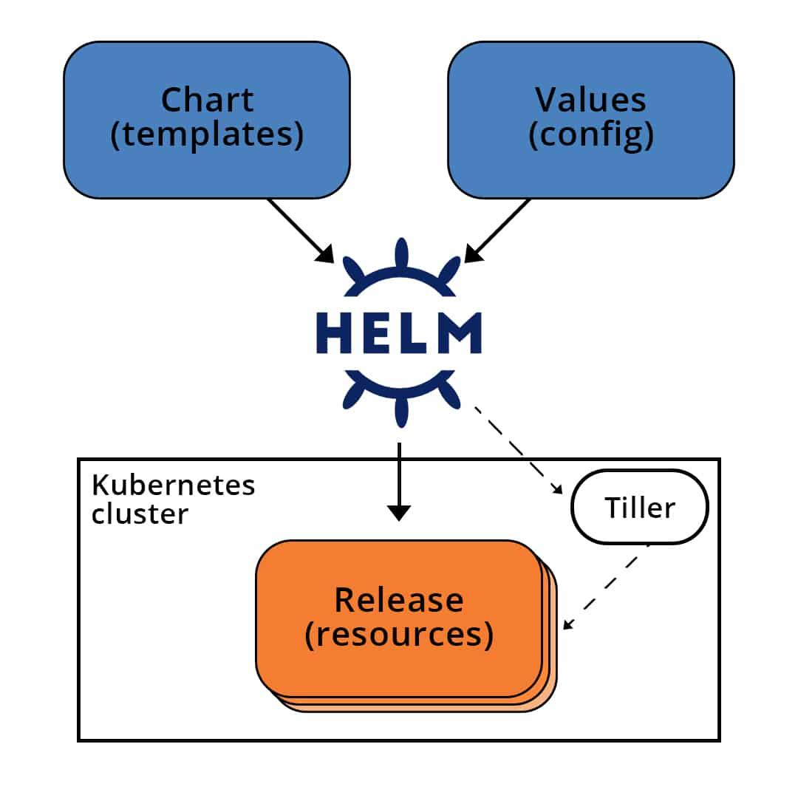

### Helm

Helm is a package manager for Kubernetes that helps you manage and configure your applications. It streamlines the process of installing, upgrading, and configuring applications on a Kubernetes cluster. Helm packages are called charts, which contain all the necessary resources for running an application, such as deployment manifests, service definitions, and config files. With Helm, you can easily install and manage complex applications on Kubernetes, making it easier to deploy and maintain applications at scale.



Writing and maintaining Kubernetes YAML manifests for all the required Kubernetes objects can be a time consuming and tedious task. For the simplest of deployments, you would need at least 3 YAML manifests with duplicated and hardcoded values. Helm simplifies this process and creates a single package that can be advertised to your cluster.

Helm is a client/server application and, until recently, has relied on Tiller (the helm server) to be deployed in your cluster. This gets installed when installing/initializing helm on your client machine. Tiller simply receives requests from the client and installs the package into your cluster. Helm can be easily compared to RPM of DEB packages in Linux, providing a convenient way for developers to package and ship an application to their end users to install.

Once you have Helm installed and configured, you are able to install production-ready applications from software vendors, such as MongoDB, MySQL and others, into your Kubernetes cluster with one very simple helm install command. Additionally, removing installed applications in your cluster is as easy as installing them. Helm has two parts to it:

- The client (CLI), which lives on your local workstation.
- The server (Tiller), which lives on the Kubernetes cluster to execute what’s needed.

The idea is that you use the CLI to push the resources you need and tiller will make sure that state is in fact the case by creating/updating/deleting resources from the chart. To fully grasp helm, there are 3 concepts we need to get familiar with:

- Chart: A package of pre-configured Kubernetes resources.
- Release: A specific instance of a chart which has been deployed to the cluster using Helm.
- Repository: A group of published charts which can be made available to others.

---

#### Helm charts

Helm Charts are simply Kubernetes YAML manifests combined into a single package that can be advertised to your Kubernetes clusters. Once packaged, installing a Helm Chart into your cluster is as easy as running a single helm install, which really simplifies the deployment of containerized applications.

Example:

```bash
YOUR-CHART-NAME/
|
|- .helmignore
|
|- Chart.yaml
|
|- values.yaml
|
|- charts/
|
|- templates/
```

- `.helmignore`: This holds all the files to ignore when packaging the chart. Similar to .gitignore, if you are familiar with git.

- `Chart.yaml`: This is where you put all the information about the chart you are packaging. So, for example, your version number, etc. This is where you will put all those details.

- `Values.yaml`: This is where you define all the values you want to inject into your templates. If you are familiar with terraform, think of this as helms variable.tf file.

- `Charts`: This is where you store other charts that your chart depends on. You might be calling another chart that your chart need to function properly.

- `Templates`: This folder is where you put the actual manifest you are deploying with the chart. For example you might be deploying an nginx deployment that needs a service, configmap and secrets. You will have your deployment.yaml, service.yaml, config.yaml and secrets.yaml all in the template dir. They will all get their values from values.yaml from above.

---

#### Benefits of Helm

##### Boosts productivity

Software engineers are good at writing software, and their time is best spent doing just that. Using Helm allows software to deploy their test environments at the click of a button.

An example of this might be that, in order to test a new feature, an engineer needs a SQL database. Instead of going through the process of installing the software locally, creating the databases and tables required, the engineer can simply run a single Helm Install command to create and prepare the database ready for testing.

##### Reduces duplication & complexity

Once the chart is built once, it can be used over and over again and by anyone. The fact that you can use the same chart for any environment reduces complexity of creating something for dev, test and prod. You can simply tune you chart and make sure it is ready to apply to any environment. And you get the benefit of using a production ready chart in dev.

##### Smooths the K8S learning curve

It’s no secret that the learning curve for Kubernetes and containers is long for your average developer. Helm simplifies that learning curve: developers do not require a full, detailed understanding of the function of each Kubernetes object in order to start developing and deploying container applications.

Helm easily integrates into CI/CD pipelines and allows software engineers to focus on writing code—not deploying applications.
